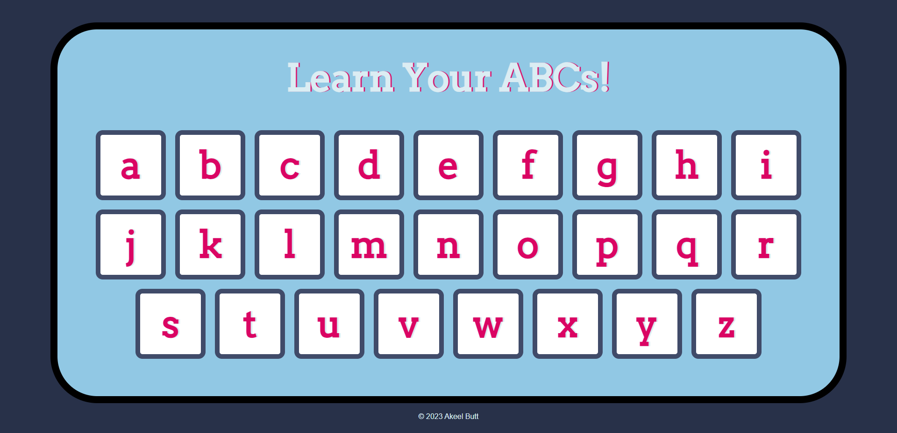

# Learn Your ABCs
[Click here to play!](https://learn-your-abcs.onrender.com)

Learn the Alphabet is a simple web application that helps you learn the English alphabet by providing audio pronunciation for each letter. It includes both clickable buttons and keyboard support for interactive learning.

## Features
- Interactive buttons for each alphabet letter.
- Keyboard support for letter pronunciation.
- Audio pronunciation for each letter.
- Stylish and responsive design.

## Usage
- Click on the alphabet buttons to hear the pronunciation of each letter.
- Alternatively, you can also press the corresponding keys on your keyboard to hear the pronunciation.

- ## Author
- [Akeel Butt](https://github.com/omegakeel)
